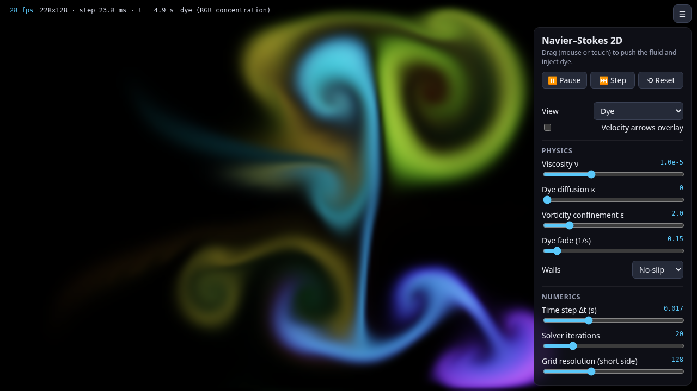
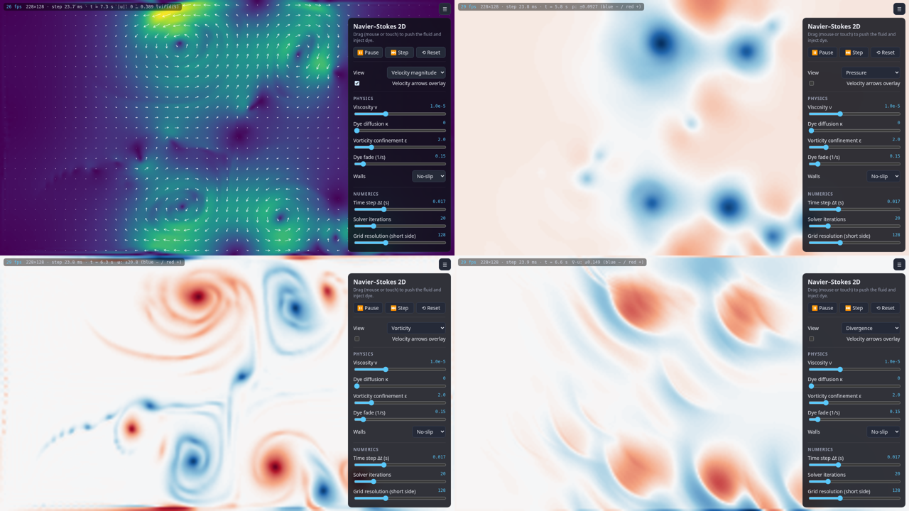

# Navier–Stokes 2D — interactive fluid simulator

A browser-based simulator for the **2D incompressible Navier–Stokes equations**
with a real-time visualization frontend. Drag with the mouse (or a finger) to
stir the fluid and inject coloured dye, and switch between views of the dye,
velocity, pressure, vorticity, and divergence fields.

**Try it live: <https://csviragh.github.io/navier-stokes-sim/>**



Built with **Vite + TypeScript** and no UI framework. The physics solver is a
standalone, DOM-free module with unit tests, so you can extend it (other
solvers, 3D, GPU) without touching the UI.

## The equations

For a fluid with constant density ρ (we use ρ = 1), velocity **u**(x, t) and
pressure p(x, t):

```
∂u/∂t + (u·∇)u = −∇p/ρ + ν∇²u + f        (momentum)
∇·u = 0                                   (incompressibility / mass)
```

- **Momentum:** a fluid parcel accelerates because of pressure differences,
  viscous friction (kinematic viscosity ν), and external forces **f** (your
  mouse).
- **Incompressibility:** the velocity field is divergence-free, so no fluid is
  created or destroyed anywhere. Pressure is not given by an equation of state.
  It is whatever field keeps ∇·u = 0, i.e. a Lagrange multiplier.

The dye is a passive scalar c (one per RGB channel) that is carried by the flow
and optionally diffuses (κ) and fades:

```
∂c/∂t + (u·∇)c = κ∇²c
```

## Numerical method

The solver follows Jos Stam's **Stable Fluids** (SIGGRAPH 1999; "Real-Time Fluid
Dynamics for Games", GDC 2003) with operator splitting. Each time step Δt runs:

1. **Forces.** User strokes blend the velocity under a Gaussian brush toward the
   pointer velocity. Optional **vorticity confinement** (Fedkiw, Stam & Jensen
   2001) adds `f = ε h (N × ω)` with `N = ∇|ω| / |∇|ω||` to restore small swirls
   that numerical dissipation removes.
2. **Viscous diffusion**, implicitly (backward Euler): `(I − νΔt∇²) u = u*`,
   solved with Gauss–Seidel. This is unconditionally stable. The sweep count
   adapts to how stiff the system is, capped by the *solver iterations* setting.
3. **Projection.** Solve the pressure Poisson equation `∇²p = (ρ/Δt) ∇·u*` with
   `∂p/∂n = 0` on the walls, using Gauss–Seidel with successive over-relaxation
   (SOR, ω = 1.7, warm-started from the previous step's pressure). Then set
   `u = u* − (Δt/ρ) ∇p`. This is the Helmholtz–Hodge decomposition, which keeps
   only the divergence-free part.
4. **Self-advection**, semi-Lagrangian: trace each velocity sample backward
   through the flow (2nd-order Runge–Kutta), then **bilinearly interpolate** the
   old field there. Results are convex combinations of old values, so this step
   is unconditionally stable too.
5. **Projection** again.
6. **Dye:** implicit diffusion, semi-Lagrangian advection, and optional
   exponential fade.

**Grid.** The grid is a uniform staggered **MAC** grid. Pressure and dye sit at
cell centres, u on vertical faces, and v on horizontal faces. The discrete
divergence, gradient, and Laplacian are mutually consistent, so the projection
drives the discrete divergence to zero, up to solver tolerance. It also avoids
the checkerboard pressure modes of a collocated grid. The shorter side of the
domain has length 1. The default grid has **128 cells on the short side**, and
the long side follows the window's aspect ratio (e.g. 228 × 128 on a 16:9
window).

**Boundaries.** The domain is a closed box with solid walls. The normal
velocity on the walls is zero. You can choose the tangential condition:
**no-slip** (default; velocity on the wall is zero) or **free-slip**. Dye and
pressure use zero-flux (Neumann) conditions.

## Features

- Full-window Canvas2D rendering. The field is drawn at grid resolution and
  upscaled with bilinear smoothing.
- Mouse, touch, and pen input through Pointer Events, including multi-touch.
  Drag to inject velocity along the drag direction and to inject dye.
- **View modes:** dye, velocity magnitude (viridis), pressure, vorticity, and
  divergence. The last three use a diverging blue/white/red map with
  auto-scaling and an on-screen legend. A velocity-arrow overlay can be shown
  on top of any view.
- **Controls:** viscosity, dye diffusion, time step, solver iterations, grid
  resolution, vorticity strength, dye fade, wall type, dye colour (or rainbow),
  brush radius, force strength, pause/play, single step, and reset.
- FPS, grid size, and solver time per step are shown in the HUD. A short
  explanation of the equations is built into the panel.
- **Keyboard:** `Space` pause, `S` step, `R` reset, `V` cycle view, `A` toggle
  arrows, `H` hide the panel.



## Getting started

Requires Node.js ≥ 20.19 (CI uses Node 22).

```bash
npm install
npm run dev       # start the dev server (http://localhost:5173)
npm test          # run the solver unit tests (Vitest)
npm run build     # type-check and build static files into dist/
npm run preview   # serve the production build locally
```

## Project structure

```
src/
  solver/            # pure numerics, no DOM: unit-testable and portable
    grid.ts          #   MAC grid layout, indexing, field allocation
    ops.ts           #   kernels: boundaries, interpolation, diffusion,
                     #   advection, projection, vorticity confinement
    fluid.ts         #   FluidSolver: state + time stepping, splat/stir input
    index.ts
  render/
    colormaps.ts     # viridis / diverging lookup tables, colour helpers
    renderer.ts      # Canvas2D field rendering + velocity-arrow overlay
  ui/
    settings.ts      # user settings and defaults
    controls.ts      # binds the HTML control panel and keyboard shortcuts
    pointer.ts       # mouse / touch / pen input via Pointer Events
  main.ts            # wiring + animation loop
  style.css
tests/
  solver.test.ts     # Vitest unit tests for the solver
index.html           # page layout, control panel, equations panel
.github/workflows/
  ci.yml             # tests + build on push / PR
  deploy-pages.yml   # GitHub Pages deployment (on push to main)
```

The solver is plain TypeScript on `Float32Array`s. You can use it on its own:

```ts
import { FluidSolver } from './src/solver';

const sim = new FluidSolver(128, 128, { viscosity: 1e-4, iterations: 30 });
sim.splat(64, 32, 0, 2, [1, 0.5, 0.2], 6); // velocity impulse + dye
for (let n = 0; n < 100; n++) sim.step();
sim.updateDiagnostics(); // fills uc, vc, divergence, vorticity
```

## Tests

`tests/solver.test.ts` checks, among other things, that:

- projection reduces the RMS divergence by more than 1000× and leaves an
  already divergence-free field unchanged;
- dye mass is roughly conserved under advection in a closed box (within 10%
  after 120 steps; semi-Lagrangian advection is not exactly conservative), and
  conserved to within 1% under pure diffusion;
- uniform-velocity advection translates a field exactly and interpolates
  bilinearly;
- 500 steps of strong random forcing with vorticity confinement produce no
  NaNs and stay bounded;
- a zero field stays exactly zero;
- walls don't leak dye, viscosity dissipates energy, and the stir, reset, and
  resample helpers behave correctly.

## Deploying to GitHub Pages

`.github/workflows/deploy-pages.yml` builds the app and publishes `dist/` to
GitHub Pages on every push to `main` (it can also be run manually). The live
site is <https://csviragh.github.io/navier-stokes-sim/>.
Vite is configured with `base: './'`, so the build works under
`https://<user>.github.io/navier-stokes-sim/` with no changes.

## Limitations

- The solver runs on the CPU in a single JS thread. On the slow, shared
  server-class CPU used for development, a step at 228 × 128 took about 24 ms
  (~30 fps in headless Chrome). Typical desktop CPUs are several times faster.
  If the frame rate drops, lower the grid resolution or the solver iterations.
- Semi-Lagrangian advection is numerically diffusive and not exactly
  mass-conserving. Fine detail smears out over time. Vorticity confinement
  partly compensates for this.
- Gauss–Seidel/SOR converges slowly for large grids. With few iterations a
  small residual divergence remains (visible in the *divergence* view).
- Vorticity confinement is integrated explicitly, so εΔt is clamped to 0.2 for
  stability.

## Ideas for next steps

- **GPU solver** (WebGL2 fragment shaders or WebGPU compute) using Jacobi or
  red-black Gauss–Seidel. This would allow 512²+ grids at 60 fps.
- **Multigrid** or **preconditioned conjugate gradient** pressure solver for
  faster, more accurate projection.
- Higher-order / less diffusive advection: **MacCormack / BFECC**, or a
  **FLIP/PIC** particle-grid hybrid.
- **Obstacles** you can draw (internal solid boundaries), **inflow/outflow**
  boundaries (wind tunnel, flow past a cylinder with a Kármán vortex street),
  and periodic boundaries.
- **Buoyancy** (Boussinesq: temperature/smoke rising) and variable density.
- Validation cases: lid-driven cavity vs. Ghia et al., decaying Taylor–Green
  vortex, Poiseuille flow.
- Particle tracers and streamlines; LIC (line-integral convolution) view.
- **3D** solver (the grid/ops separation is designed to make this a parallel
  module) with volume rendering.
- Move the solver into a Web Worker to keep the UI thread free.
